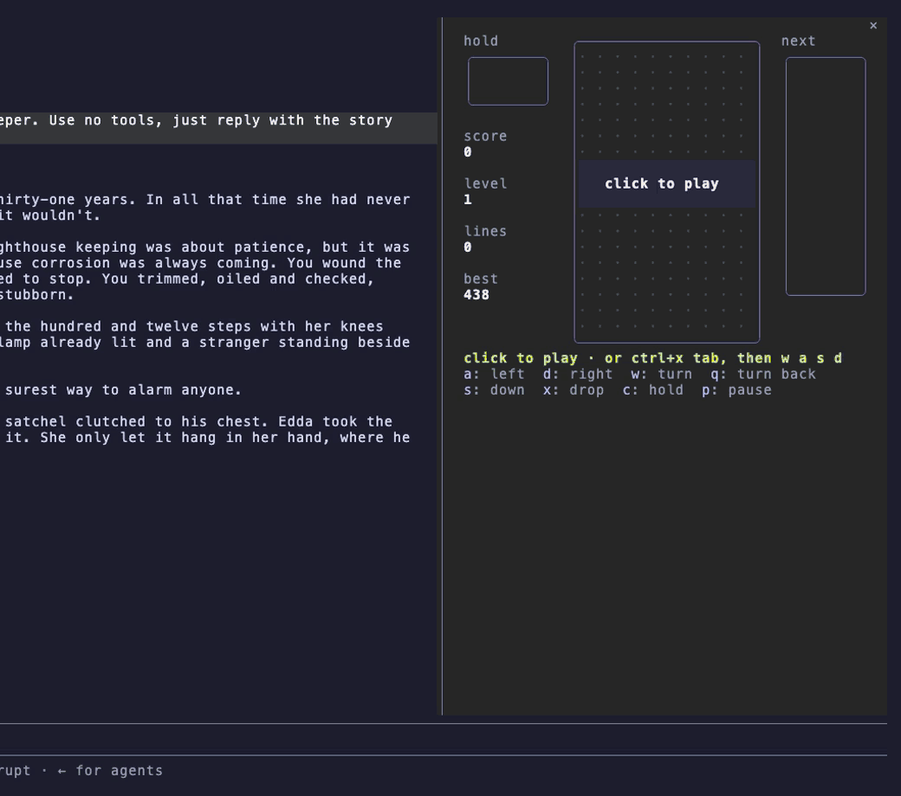

# line-clear

**A falling-block game for the 40 seconds Claude spends thinking.**

You asked for a refactor. Claude is reading 31 files. You could watch the
spinner. Or you could clear four rows at once while it works.



A Claude Code mod. Seven four-cell pieces fall into a well ten wide and
eighteen deep; fill a row and it goes. The rules are the ones the modern games
share, spins, back to back and combos included. The look is the game's own:
its own colors, its own well, its own words for what you just did.

Nothing is sent anywhere, nothing touches your files, and the only thing it
remembers is your best score. Your productivity remains your own business.

## How to play

Type `/line-clear` to open the pane. Typed while Claude is working, the
command waits until the turn ends, so open the pane first and keep it open:
the game plays while Claude generates and runs tools.

There are two ways to give the game the keys.

- **Click the well.** Arrows, Space and the letters below go to the game.
  Escape gives the keys back to the prompt.
- **Keyboard only: ctrl+x tab.** The pane takes the focus and its Buttons'
  hotkeys play: `a` `d` `w` `q` `s` `x` `c` `p`. Escape gives the keys back.

| Move | Clicked well | Pane hotkey |
| --- | --- | --- |
| left, right | left, right arrow, or `a`, `d` | `a`, `d` |
| slide to the wall | shift with left or right, or `A`, `D` | |
| turn clockwise | up arrow or `w` | `w` |
| turn back | `z` or `q` | `q` |
| soft drop | down arrow or `s` | `s` |
| hard drop | Space or `x` | `x` |
| hold | `c` | `c` |
| pause | `p` | `p` |

Hold left, right or down and the piece keeps going. A terminal never says
when a key is let go, only that it came again, so the game counts a key as
held when it comes again within 120 ms. Your keyboard waits a few hundred
milliseconds before it starts repeating a held key, so a held drop, turn,
hold or pause acts twice (on the press, then once when the repeat starts)
and then stops: holding the drop key never drops piece after piece.

A click starts a game and, after game over, starts the next one; with the
pane focused, `p` does.

The status line under the well always says who has the keys:
`playing · Esc gives keys back` (the clicked well),
`keys: w a s d · Esc gives keys back` (the focused pane),
`paused · p resumes` (you paused it), or, in the warning color,
`click to play · or ctrl+x tab, then w a s d`, with a card over the well,
when the keys go to the prompt.

Beat your best and the game-over card turns gold and twinkles. The best
label says `new!` the moment you pass it, so you know to stop playing
safe. You will not stop playing safe.

### Why click to play, and why the keyboard path has no arrows

Claude Code gives a mod's game region the keyboard only after a click on it:
no command, focus request or keybinding gives it the keys, and Escape never
reaches it (it hands the keys back). So the game cannot see when it loses the
keys. It infers it: two seconds with no key and the well takes itself as
unfocused, pauses, and shows `click to play` again; any key or click resumes
it. That pause is a guess from silence, not a signal.

Without a mouse, ctrl+x tab focuses the pane, where a Button's hotkey is one
letter or digit. The arrows and Tab belong to the pane there (they scroll and
move between Buttons), so a keyboard-only player steers with letters and
cannot send the game arrows or Space.

### Mid-turn, watch the prompt

A key the game does not have lands on the prompt, and mid-turn some of those
keys act: Escape at the prompt interrupts Claude, Left opens the background
agents view, Up pulls back a queued message. Check the status line before
pressing keys. Press Escape once to leave the game, and do not Tab around the
focused pane mid-turn: Tab can move the focus onto Claude Code's own stop
control, where Escape may cancel the turn.

The pane needs 46 columns and 23 rows. Below 46 columns it asks for room.

## Settings

| Setting | Default | What it does |
| --- | --- | --- |
| `openOnTurn` | off | Opens the pane, without taking the keys, each time a turn starts. Claude Code places a pane opened this way only on a terminal 144 columns wide (110 once you have opened line-clear yourself in a session). |
| `startLevel` | 1 | The level each game starts at, a whole number from 1 to 15; anything else reads as 1. |

Change it in `/config`, or under `pluginConfigs["line-clear"].options` in
settings.

## Privacy

Nothing leaves the machine. The mod makes no network call and reads no
files. It keeps one value across sessions, the best score, as a number in the
plugin's own store. It hooks no tool, prompt, model or permission event, and
adds nothing to the transcript.

## The rules

The rules follow the widely documented modern guideline mechanics, as the
[Hard Drop wiki](https://harddrop.com/wiki/) describes them:
[SRS](https://harddrop.com/wiki/SRS) turns and kicks,
[spins](https://harddrop.com/wiki/T-Spin) by the three-corner rule,
[scoring](https://harddrop.com/wiki/Scoring) with
[back to back](https://harddrop.com/wiki/Back-to-Back) and
[combos](https://harddrop.com/wiki/Combo), and
[move reset](https://harddrop.com/wiki/Lock_delay) lock delay. The well is
18 rows deep rather than 20, and the look and the words are the game's own.

The engine in [`hooks/game/`](hooks/game) is pure: no clock, no randomness,
no I/O. `newGame(seed, options)` starts a game and
`step(state, input, nowMs)` returns the next one, applying the time first
(gravity rows and locks due by `nowMs`) and then the input. The same seed and
inputs always replay the same game.

- **Well.** 10 columns by 18 visible rows, with 4 hidden rows above.
- **Entering.** A piece spawns flat in the two hidden rows just above the
  well, centred (the 3-wide ones left of centre), and drops one row at once
  when there is room, so it shows straight away. A lock that clears nothing
  brings the next piece on at once.
- **Pieces.** Seven four-cell pieces, dealt from a 7-bag (each run of seven
  holds one of each) shuffled by a seeded generator. The next five are shown.
- **Turning.** Super Rotation System states and wall kicks, from its published
  kick table ([`hooks/game/pieces.ts`](hooks/game/pieces.ts)). The square
  never kicks.
- **Hold.** Once per piece; allowed again when a piece locks.
- **Clearing.** A lock that clears rows holds the next piece back for
  200 ms while the rows go. Moves and drops made meanwhile are dropped; the
  last turn and a hold are done as the next piece enters.
- **Gravity.** `(0.8 - (level - 1) * 0.007) ^ (level - 1)` seconds a row:
  1000 ms at level 1, 355 ms at level 5, 64 ms at level 10, and no faster than
  level 15's 7 ms.
- **Lock delay.** A resting piece locks after 500 ms. Each of the first 15
  moves or turns made while resting restarts the delay, and the 16th locks the
  piece at once; reaching a new lowest row with any cell restores all 15.
- **Score.** A lock that clears 1, 2, 3 or 4 rows scores 100, 300, 500 or 800
  times the level it was made at. A soft drop scores 1 a row, a hard drop 2.
- **Spins.** A T whose last successful move was a turn, locking with three of
  the four cells diagonal to its centre taken (walls and floor count), spins:
  both cells on its pointing side taken, or a turn whose kick moved it one
  across and two rows, is a spin, else a mini. A spin scores 400, 800, 1200
  or 1600 for none to three rows, a mini 100, 200 or 400 for none to two,
  times the level.
- **Back to back.** A difficult clear (four rows at once, or a spin that
  clears rows) right after another scores half again. A single, double or
  triple ends the run; a lock that clears nothing does not.
- **Combos.** Each clear right after another adds 50 times the run's count
  times the level: the second clear in a row is combo 1, the third combo 2.
  A lock that clears nothing ends the run.
- **All clear.** A clear that empties the well adds 800, 1200, 1800 or 2000
  for one to four rows, 3200 for a back to back four, times the level, on
  top of the clear's own points.
- **Levels.** Fixed goal: up one every 10 cleared rows from the start level,
  called out as it happens. The game is endless; gravity stops speeding up
  at level 15.
- **Game over.** Block out (the next piece has no room to enter) or lock out
  (a piece locks with every cell in the hidden rows).
- **Pause.** Freezes gravity and the lock delay; ignores every other input.
  The board stays in view, dimmed, and the status line reads
  `paused · p resumes`.

The numbers live in [`hooks/game/rules.ts`](hooks/game/rules.ts).

In the pane, the game's time is the frame clock: each 50 ms frame moves the
game on 50 ms. When Claude Code draws frames late (measured at about 55 ms a
frame mid-turn), the game runs that much slower instead of skipping rows.
The drawing thread does have `performance.now()`, but it reads the wall
clock, which the test harness's frame clock does not move, so the fixed step
is what keeps every timing test deterministic. Each game's seed comes from
the clock when it starts.

Not in this game:

- **Key remapping.** The letters are fixed; on AZERTY and other layouts use
  the arrows on the clicked well.
- **Ambiguous-width terminals.** The blocks and box lines are East Asian
  ambiguous-width characters, which most terminals draw one column wide; a
  terminal set to draw them two wide breaks the layout.
- **Delayed auto shift settings.** A held key repeats at your system's key
  repeat rate, not at tunable game rates.
- **A Marathon end, garbage and versus.** One endless solo game.

## Install

Requires Claude Code 2.1.287 or later (mods). Developed and tested on 2.1.294.
The game is designed for a dark Claude Code theme; on a light theme some of
it is hard to read.

From the ilovepixelart marketplace, which pins each mod to its latest release:

```
/plugin marketplace add ilovepixelart/claude-code-mods
/plugin install line-clear@ilovepixelart
```

Or in one line, straight from this repository, following `main`:

```
/plugin install line-clear --marketplace ilovepixelart/line-clear-mod
```

To stay on one release, add this repository at its tag instead, then install
from it:

```
/plugin marketplace add ilovepixelart/line-clear-mod#line-clear--v0.1.0
/plugin install line-clear@line-clear-mod
```

Run `/reload-plugins` (or start a new session) after installing. To take a new
release later, run `claude plugin update line-clear@ilovepixelart` in your
shell, or `line-clear@line-clear-mod` if you installed from this repository. Each [release](https://github.com/ilovepixelart/line-clear-mod/releases)
also carries a zip of the plugin for `claude --plugin-url`, and
[CHANGELOG.md](CHANGELOG.md) lists what each one changed.

To try it from a clone without installing: `claude --plugin-dir /path/to/line-clear-mod`.

## Versioning

Releases follow [Semantic Versioning](https://semver.org/). While the version
is 0.x, any release may change behaviour. The one value the mod keeps, the
best score, is a plain number in the plugin's own store.

## Access

What `claude plugin validate .` reports the module hooks and calls:

- hooks: `session.start` (registers `/line-clear`), `command.run`
  (`line-clear`), `turn.start` (only with `openOnTurn` on), `ui.message` and
  `ui.render` (its own pane only);
- calls: `$.command.register`, `$.ui.open`, `$.ui.resolve`, `$.ui.invalidate`,
  `$.clock.now`, `$.store.get` and `$.store.set` (the best score), and
  `$.state` for the pane's own Button presses this session.

## Development

```sh
node scripts/gates.mjs          # release check, validate, test, typecheck
node scripts/gates.mjs --load   # also the tests eight times at once
```

Both workflows run the same script, so a green local run is the check CI
makes.

`tsc` needs the type declarations Claude Code writes into
`.claude-plugin/types/` when it loads the plugin; the gates write them with a
`claude --plugin-dir . -p` run when they are missing, which works even when it
stops at "Not logged in".

The demo is recorded with [vhs](https://github.com/charmbracelet/vhs) in a
scratch project, with Claude Code running in tmux so a script can read the
well and play.

To release, add the version's section to `CHANGELOG.md`, set the version in
`.claude-plugin/plugin.json` (its only home), merge, then run
`claude plugin tag --push` on `main`. The pushed `line-clear--v<version>` tag
starts the release workflow, which runs the gates again with the tag checked
against the version and publishes the GitHub release with the CHANGELOG
section as notes, `line-clear-<version>.zip` for `claude --plugin-url`, and the
zip's `.sha256`.

## License

MIT
